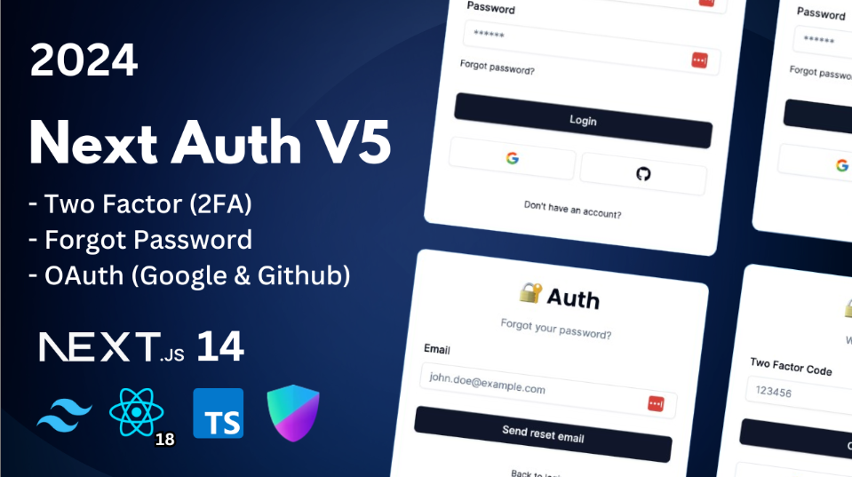

[![Facebook-Page][facebook-shield]][facebook-url]
[![Twitter][twitter-shield]][twitter-url]
[![Instagram][instagram-shield]][instagram-url]
[![LinkedIn][linkedin-shield]][linkedin-url]

<p align="center">
  <h1 align="center">Next Auth</h1>
  <div align="center"><h3>Project Link: <a href="https://github.com/rsshonjoydas/next-auth">GitHub</a></h3></div>
</p>

### Next Auth v5 - Advanced Guide



<!-- TABLE OF CONTENTS -->

## Table of Contents

- [Key Features](#key-features)
- [Prerequisites](#prerequisites)
- [Start the app](#start-the-app)
- [How to setup the initial project](#how-to-setup-the-initial-project)
- [Contact](#contact)

This is a repository for Next Auth v5 - Advanced Guide (2024)

### Key Features:

- 🔐 Next-auth v5 (Auth.js)
- 🚀 Next.js 14 with server actions
- 🔑 Credentials Provider
- 🌐 OAuth Provider (Social login with Google & GitHub)
- 🔒 Forgot password functionality
- ✉️ Email verification
- 📱 Two factor verification
- 👥 User roles (Admin & User)
- 🔓 Login component (Opens in redirect or modal)
- 📝 Register component
- 🤔 Forgot password component
- ✅ Verification component
- ⚠️ Error component
- 🔘 Login button
- 🚪 Logout button
- 🚧 Role Gate
- 🔍 Exploring next.js middleware
- 📈 Extending & Exploring next-auth session
- 🔄 Exploring next-auth callbacks
- 👤 useCurrentUser hook
- 🛂 useRole hook
- 🧑 currentUser utility
- 👮 currentRole utility
- 🖥️ Example with server component
- 💻 Example with client component
- 👑 Render content for admins using RoleGate component
- 🛡️ Protect API Routes for admins only
- 🔐 Protect Server Actions for admins only
- 📧 Change email with new verification in Settings page
- 🔑 Change password with old password confirmation in Settings page
- 🔔 Enable/disable two-factor auth in Settings page
- 🔄 Change user role in Settings page (for development purposes only)

<!-- HOW TO RUN -->

### Prerequisites

**Node version 20.x.x**
**Yarn version 1.22.x**

### Start the app

Certainly, if you're working on a Node.js project and you have a development script, such as `yarn dev`, that you typically use to run your application during development, you can include that step in your workflow as well. Here's the updated order of commands:

1. **Clone this repository**:

   ```sh
   git clone git@github.com:rsshonjoydas/next-auth.git
   ```

2. **Environment Variables Setup**:
   To rename the `.env.example` file to `.env` and add your environment-specific configuration, you can use the following command in a Unix-like shell (such as Linux or macOS):

   ```bash
   mv .env.example .env
   ```

   This command renames the `.env.example` file to `.env`.

   After renaming the file, you can open the `.env` file using a text editor and add your environment-specific configuration variables and their values. For example:

   ```
   DATABASE_URL=your_database_url_here
   API_KEY=your_api_key_here
   SECRET_KEY=your_secret_key_here
   ```

   Replace `"your_database_url_here"`, `"your_api_key_here"`, and `"your_secret_key_here"` with your actual configuration values. The `.env` file is commonly used to store sensitive or environment-specific configuration variables for your application.

3. **Install packages**

   ```shell
   yarn install
   ```

4. **Prisma Setup**:

   - Generate Prisma Client Code:

     ```bash
     npx prisma generate
     ```

   - Push Database Changes:

     ```bash
     npx prisma db push
     ```

   - Launch Prisma Studio: `optional`

     ```bash
     npx prisma studio
     ```

     Your `Prisma` database is accessible locally at the following address: [http://localhost:5555](http://localhost:5555)

5. **Run Your Application in Development Mode**:

   ```bash
   yarn dev
   ```

   Your `project` is accessible locally at the following address: [http://localhost:3000](http://localhost:3000)

### How to setup the initial project

1.  **Install Next JS**

    ```sh
    yarn create next-app --typescript --tailwind --eslint
    ```

2.  **Visual Studio Settings configuration `optional`**

    - ##### Get VSCode [Settings.json](https://github.com/rsshonjoydas/docs/blob/main/docs/vscode.md) file

3.  **Airbnb style guide setup**

    - ##### Get [eslintrc.json](https://github.com/rsshonjoydas/docs/blob/main/docs/airbnb-style-guide.md) file

4.  **Git Hooks for Husky**

    - ##### [How to use husky](https://github.com/rsshonjoydas/docs/blob/main/docs/husky.md)

5.  **Shadcn Ui Setup**
    - Initialize Shadcn ui
      ```bash
      npx shadcn-ui@latest init
      ```
    - How to use [Shadcn ui](https://ui.shadcn.com/) `optional`
      ```bash
      npx shadcn-ui@latest add button
      ```
    - Overwrite existing ui components `optional`
      ```bash
      npx shadcn-ui@latest add button --overwrite
      ```

## Contact

Shonjoy Das - [rsshonjoy@gmail.com](mailto:rsshonjoy@gmail.com)

<!-- MARKDOWN LINKS & IMAGES -->

[facebook-shield]: https://img.shields.io/badge/-Facebook-black.svg?style=flat-square&logo=facebook&color=555&logoColor
[facebook-url]: https://facebook.com/rsshonjoydas
[twitter-shield]: https://img.shields.io/badge/-Facebook-black.svg?style=flat-square&logo=twitter&color=555&logoColor
[twitter-url]: https://twitter.com/rsshonjoydas
[instagram-shield]: https://img.shields.io/badge/-Instagram-black.svg?style=flat-square&logo=instagram&color=555&logoColor
[instagram-url]: https://instagram.com/rsshonjoydas
[linkedin-shield]: https://img.shields.io/badge/-LinkedIn-black.svg?style=flat-square&logo=linkedin&colorB
[linkedin-url]: https://linkedin.com/in/rsshonjoydas
